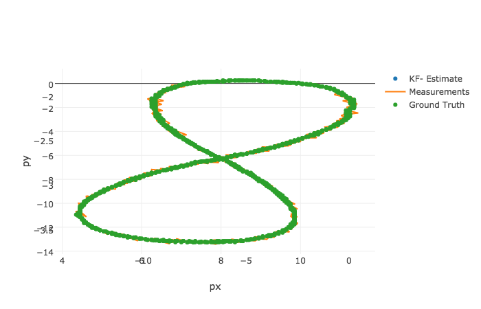

# Self-Driving Car Engineer Nanodegree
# Robotics: Sensor Fusion
## Project: Unscented Kalman Filter (UKF)

---

### Overview
This is the 7th project of the [Self Driving Car Engineer Nanodegree](https://www.udacity.com/course/self-driving-car-engineer-nanodegree--nd013) I am taking part.  
The aim of this project was to build a UKF (Unscented Kalman Filter) in order to track the trajectory from both Radar and Lidar data.

### Results
Here are the measurment that are given to the UKF algorithm. For the sake of comprehension, I also plotted the 'ground truth' which corresponds to the actual trajectory observed. 

Below is the result of the UKF, based solely on the measurements from Lidar and Radar data that it has received: 

We can see that the UKF is very precise and correctly predicted the trajectroy observed. 

For the sake of completness, the following image is stacking all the above-mentionned image:  

---

## Dependencies

* cmake >= v3.5
* make >= v4.1
* gcc/g++ >= v5.4

## Basic Build Instructions

1. Clone this repo.
2. Make a build directory: `mkdir build && cd build`
3. Compile: `cmake .. && make`
4. Run it: `./UnscentedKF path/to/input.txt path/to/output.txt`. You can find
   some sample inputs in 'data/'.
    - eg. `./UnscentedKF ../data/sample-laser-radar-measurement-data-1.txt output.txt`